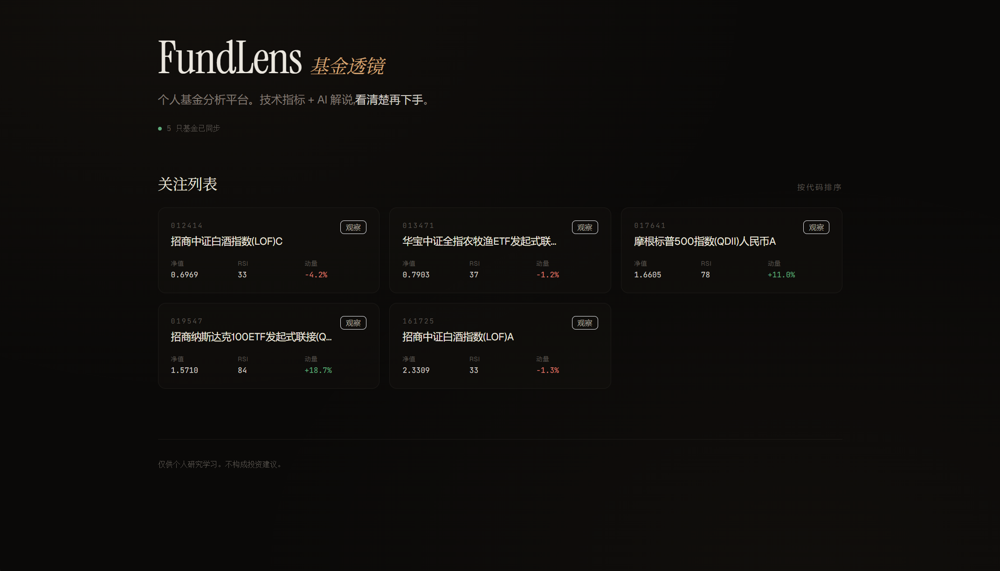
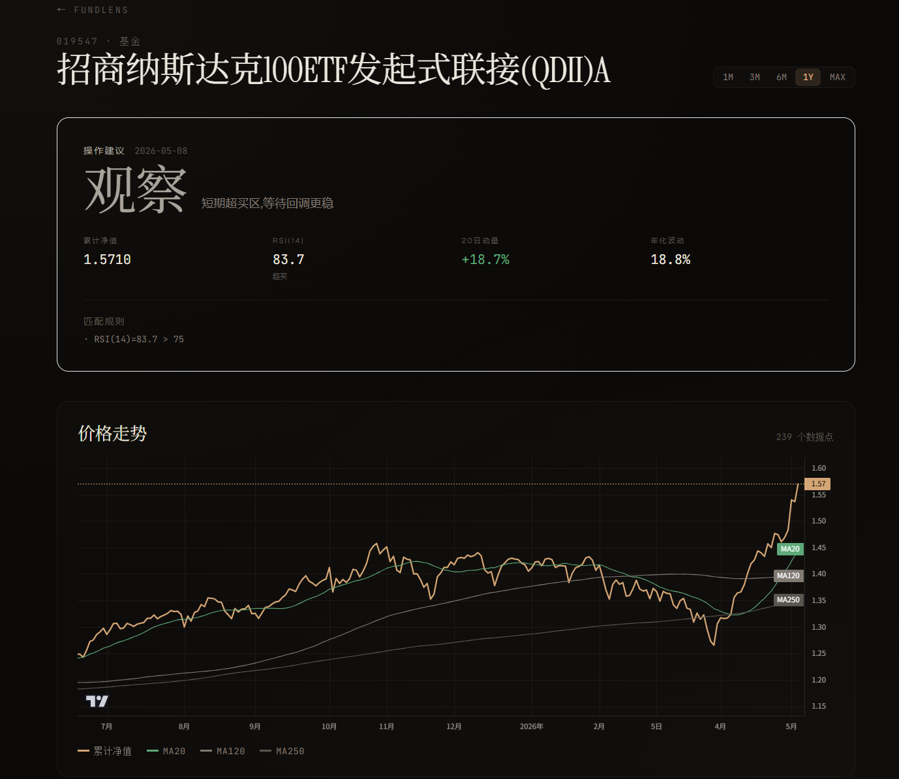
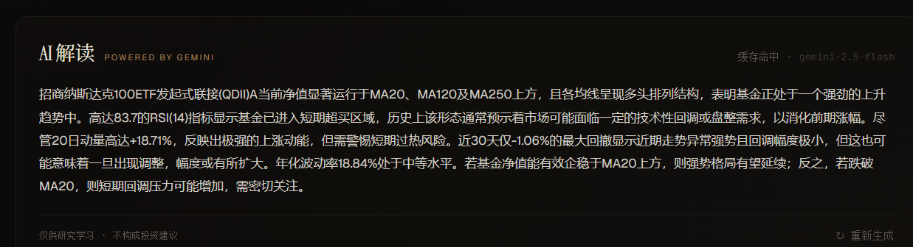
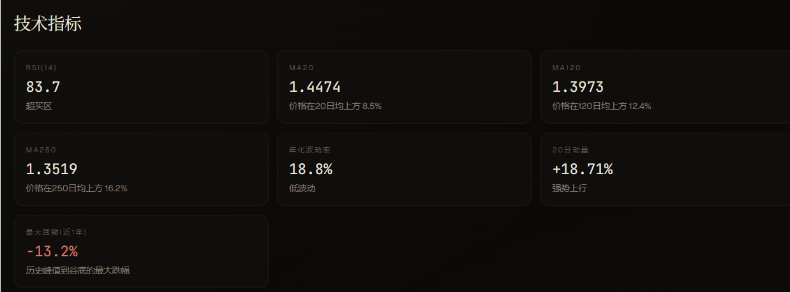
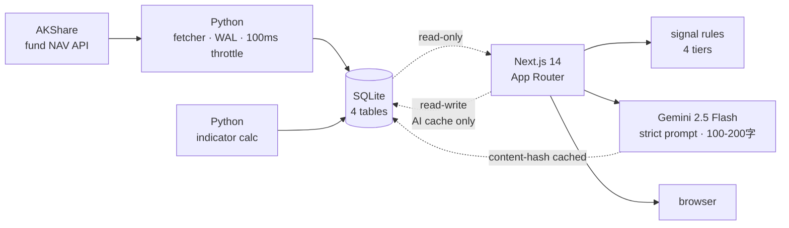

<div align="center">

# FundLens · 基金透镜

*A personal fund analysis platform that combines rule-based signals with LLM-generated commentary.*

[](https://github.com/sirisdu-sketch/fundlens/actions/workflows/ci.yml)


**[Live Demo](https://fundlens.vercel.app)** · **[Setup](#-quick-start)** · **[Architecture](#-architecture)**

</div>

---

## What it does

A self-hosted dashboard that pulls Chinese open-end fund NAV history, computes technical indicators (RSI / MA / drawdown / momentum / volatility), generates a four-tier action signal (轻仓 / 持有 / 观察 / 回避) via a small rule engine, and asks Gemini 2.5 Flash to translate the numbers into a 100-200 character plain-language reading.

Built in 3 days as a portfolio project. Designed to be **interpretable**: every indicator has a hand-calculation test, every signal has a printable rule, every AI response uses only the numbers shown on screen — no external context, no predictions, no "buy" recommendations.

## Screenshots

> *Run the project locally to see the live UI; replace these placeholders with real screenshots after first run.*

| Home — fund list with signal tags | Detail — signal hero + chart + indicators |
|:--:|:--:|
|  |  |
| <em>AI commentary panel</em> | <em>Technical indicators with interpretation</em> |
|  |  |

## Architecture



**Two-connection strategy.** Python writes raw data (`sync`, `compute`); Next.js reads it (only). AI cache is the one thing Next.js owns, so it has a separate read-write connection for `research_contexts`. This isn't security theater on a single-user app — it's a habit that scales to multi-tenant.

**Signal split.** Rule engine (`lib/signals.ts`) decides *what* (轻仓 / 持有 / 观察 / 回避); LLM decides *why* (100-200 character commentary). They never overlap. Rules are 5 lines of conditional code; the LLM cannot say "buy" or "sell" no matter how the prompt is jailbroken.

## Tech stack

| Layer | Choice | Why |
|---|---|---|
| Data source | AKShare | Only free source covering full Chinese fund market |
| Storage | SQLite + WAL | Embedded, zero ops, handles millions of rows on a laptop |
| Indicators | NumPy / Pandas | Standard; vectorised; trivial to unit-test |
| Web | Next.js 14 (App Router) | Single deploy, RSC for SSR signal computation, API routes co-located |
| Charts | TradingView lightweight-charts | 35 KB, real financial-charts library, not a generic charting toolkit |
| Styling | Tailwind + custom tokens | No off-the-shelf UI kit; design system is a deliberate aesthetic choice |
| LLM | Gemini 2.5 Flash | Free tier covers personal use; `thinkingBudget: 0` for latency-sensitive UX |
| Hosting | Vercel + Turso *(planned)* | SQLite-compatible cloud DB so the same query layer ships unchanged |
| CI | GitHub Actions | Two parallel jobs: Python (ruff + pytest + mypy) and Web (tsc + lint + build) |

## Notable decisions

**RSI uses SMA, not Wilder EMA** — Hand-calculation tests would otherwise be unverifiable. Numerical drift vs. TradingView is < 1pt, acceptable for an interpretability-first system. See the docstring in `fundlens/indicators/momentum.py`.

**Indicators are batch-computed and stored; max drawdown is computed on the fly** — Per-day indicators don't change once history is in. Max drawdown depends on the chosen time range, so storing it per-day is meaningless. The split lives in `web/lib/queries.ts::computeMaxDrawdown`.

**Content-hash caching for AI** — `contextHash()` rounds each indicator to display precision and SHA-256s the resulting JSON. Same numbers ⇒ same hash ⇒ cache hit, zero tokens. Different model? Composite primary key keeps both versions for comparison.

**Schema is inlined into the application** — `web/lib/db-init.ts` ships a `CREATE TABLE IF NOT EXISTS` block as a TypeScript string and runs it at first DB access. No bootstrap step, idempotent, deploy-friendly. `schema.sql` at the repo root is preserved as human-readable canon.

**No FastAPI** — A separate Python web server would have doubled the deploy surface and saved nothing. The Python side is data-ingestion-only; Next.js owns the HTTP layer end-to-end.

## Quick start

Requires Python 3.11+ and Node 20+.

```bash
# 1. Python side — pull NAVs and compute indicators
pip install -e ".[dev]"
python -m fundlens.sync       # ~10s for 5 funds
python -m fundlens.compute    # ~1s

# 2. Web side
cd web
cp .env.local.example .env.local   # then fill in GEMINI_API_KEY
npm install
npm run dev                   # open http://localhost:3000
```

Want to extend the watchlist? Edit `fundlens/codes.py` and rerun `sync && compute`.

## Project layout

```
fundlens/
├── fundlens/              # Python package
│   ├── fetcher.py         # AKShare wrapper · 100ms throttle + 3-retry backoff
│   ├── sync.py            # ingest CLI
│   ├── compute.py         # indicator batch CLI
│   └── indicators/        # RSI · MA · drawdown · volatility · momentum
├── tests/                 # 13 pytest cases, every indicator has hand-calc reference values
├── schema.sql             # canonical schema (also inlined in web/lib/db-init.ts)
├── web/
│   ├── app/               # Next.js App Router — pages + API routes
│   ├── components/        # chart · signal-card · ai-research · ...
│   └── lib/
│       ├── db.ts          # read-only connection
│       ├── ai-cache.ts    # read-write connection for AI cache
│       ├── ai.ts          # Gemini prompt + call · @google/genai
│       ├── signals.ts     # rule engine (4-tier signal)
│       └── queries.ts     # all SQL lives here
└── .github/workflows/ci.yml
```

## Testing

```bash
pytest                      # 13 cases · every indicator has a hand-calc test
cd web && npx tsc --noEmit  # strict TypeScript, 0 errors
cd web && npx next lint     # ESLint
cd web && npm run build     # production build sanity check
```

The CI workflow runs all of the above on every push.

## Disclaimer

For personal study and analysis. **Not financial advice.** Signals come from technical indicators alone — they encode no fundamental analysis, no macro context, no forward expectations. The LLM commentary is explicitly constrained to describing current state, never predicting future state.

## License

MIT — see [LICENSE](LICENSE).
